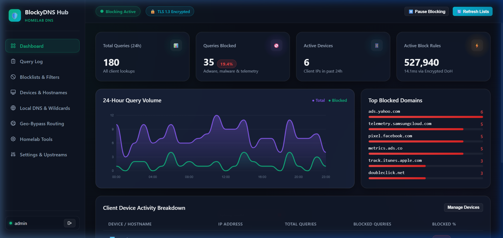
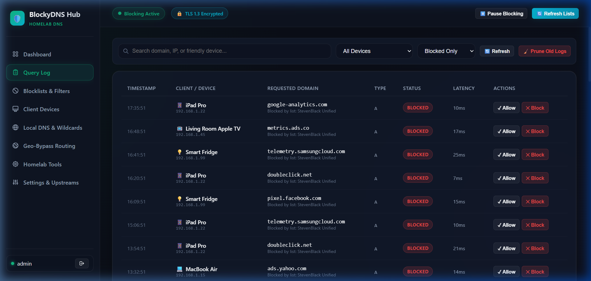
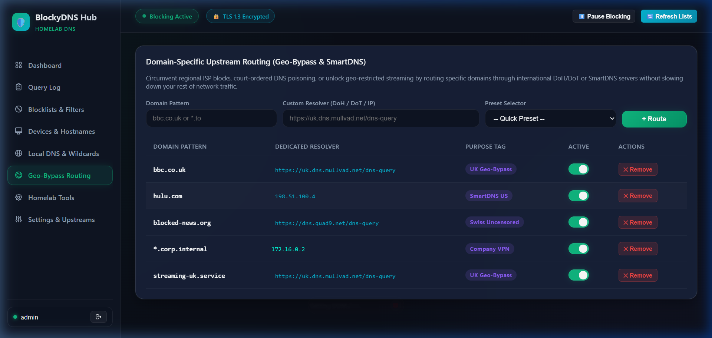
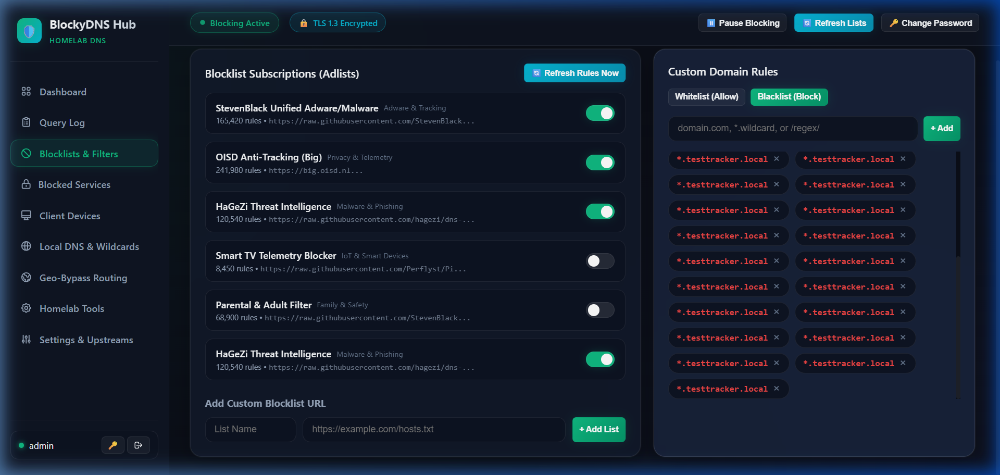
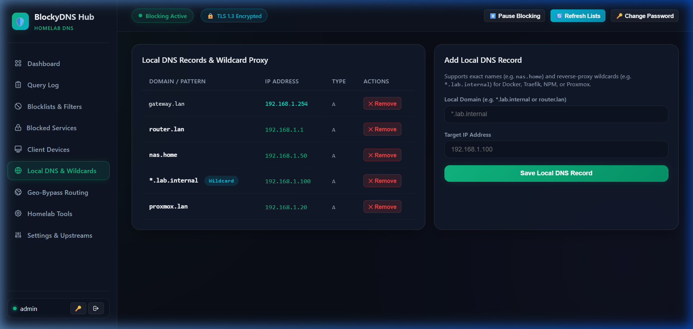
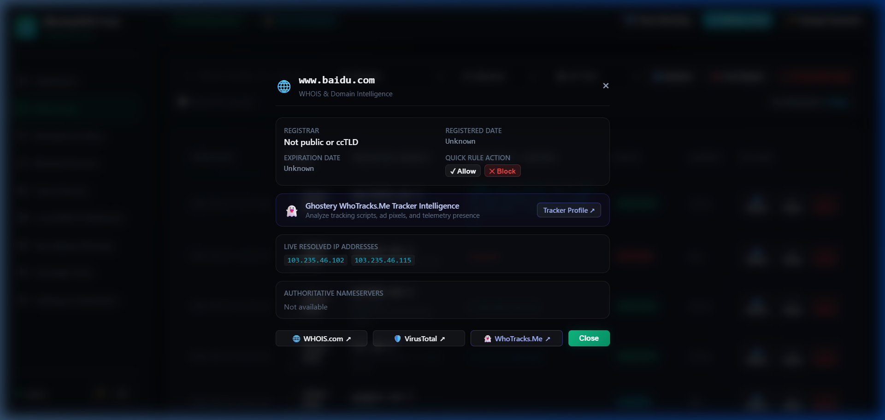

# 🛡️ BlockyDNS Hub

> **High-Performance, Privacy-First Homelab DNS Appliance & Next-Gen Management Dashboard**  
> Powered by the ultra-fast Go DNS engine (**Blocky**) and an end-to-end encrypted management portal.

[-blue?logo=docker)](docker-compose.ghcr.yml)
[](https://github.com/akhilgupta2007/blocky-dns-UI/pkgs/container/blocky-dns-ui)
[-00ADD8?logo=go)](https://github.com/0xERR0R/blocky)
[](#-security--anti-sniffing-shield)
[](#-performance-benchmarks-raspberry-pi-1gb-ram)
[](https://github.com/akhilgupta2007/blocky-dns-UI/releases)
[](LICENSE)

---

## 📖 What is BlockyDNS Hub?

**BlockyDNS Hub** is a self-hosted, full-featured DNS ad-blocker and network management suite. It decouples core DNS packet processing from the management web interface, pairing the blazing-fast **Blocky Go engine** (`0xERR0R/blocky`) with an asynchronous **FastAPI/SQLite Hub** wrapped in a modern, dark glassmorphic dashboard.

Engineered specifically to deliver enterprise-grade performance on single-board computers (like **Raspberry Pi 2/3/4/5, Pi Zero 2W, or mini-PCs**), BlockyDNS Hub delivers sub-millisecond query responses, native DoH/DoT encryption, live threat telemetry, domain-specific geo-bypass routing, and seamless AdGuard/ABP rule compatibility.

<p align="center">
  
</p>

---

## 📸 Visual Tour & Screenshots

| Modern Dark Cyberpunk Dashboard | Live Query Log & Threat Telemetry |
| :---: | :---: |
|  |  |
| **Domain Geo-Bypass & Latency Routing** | **AdGuard / ABP Custom Rules Engine** |
|  |  |
| **Homelab Local DNS & Reverse Records** | **1-Click Deep WHOIS & Threat Intel** |
|  |  |

---

## ⚖️ How Does It Compare to AdGuard Home & Pi-hole?

Most homelab setups rely on either **Pi-hole** or **AdGuard Home**. BlockyDNS was engineered to eliminate the fundamental architectural compromises present in both:

```
┌────────────────────────────────────────────────────────────────────────┐
│                        BLOCKYDNS DECOUPLED STACK                       │
├──────────────────────────────────┬─────────────────────────────────────┤
│   [ blocky-engine (Pure Go) ]    │      [ blockydns-hub (FastAPI) ]    │
│   • Answers UDP/TCP/DoH/DoT      │      • Web Portal (TLS 1.3)         │
│   • In-Memory Optimistic Cache   │      • Real-time Query SSE Stream   │
│   • Parallel Upstream Racing     │      • WHOIS & Ghostery Intelligence│
│   • Zero downtime during restarts│      • SQLite WAL Storage & Pruning │
└──────────────────────────────────┴─────────────────────────────────────┘
```

### Feature & Architecture Comparison Matrix

| Capability | **BlockyDNS Hub** (Our Setup) | **AdGuard Home** | **Pi-hole (FTL)** |
| :--- | :--- | :--- | :--- |
| **Core Architecture** | **Decoupled 2-Container Microservice** | Monolithic (DNS + Web in 1 binary) | Multi-component (FTL + PHP + Lighttpd) |
| **Fault Isolation** | ✅ **100% Isolated**: DNS engine never drops queries when updating or restarting the Web UI | ❌ If the Web UI crashes or restarts, **all DNS in your house goes down** | ❌ Web and FTL tightly coupled through local sockets |
| **Encrypted Upstreams** | ✅ **Native DoH (HTTP/2), DoT** out of the box | ✅ Native DoH, DoT, DoQ | ❌ **No native DoH/DoT** (Requires extra sidecars like `cloudflared` or `unbound`) |
| **Upstream Racing Strategy** | ✅ **Parallel Best** (Races all upstreams simultaneously for lowest latency) | Parallel race / Load balancing | Basic fastest / Random |
| **Caching Engine** | ✅ **Optimistic Prefetching**: Serves cache in < 1ms, refreshes in background | Optimistic cache | Standard `dnsmasq` TTL cache |
| **RAM Footprint** | **~118 MB total** (~60 MB engine + ~58 MB hub) | ~90 – 160 MB | ~100 – 180 MB |
| **CPU Overhead** | **< 0.6%** on Raspberry Pi | < 1% | < 1% |
| **Query Intelligence** | ✅ **1-Click WHOIS, VirusTotal & Ghostery WhoTracks.Me** tracker breakdown | Basic IP / Client tag | Basic IP / Client tag |
| **AdGuard / ABP Syntax** | ✅ **Built-in Auto-Parser** (Converts `@@||domain^` and `||domain^` automatically) | Native ABP syntax | ❌ Plain hosts & regex only (No ABP syntax) |
| **1-Click App Blocker** | ✅ **20 Pre-Compiled Categories** (Social Media, Adult, Gaming, Streaming) | Blocked services toggle | ❌ None (Requires manual regex/domain lists) |
| **Domain Geo-Bypass Routing**| ✅ **Visual Routing Catalog + Speed Presets** (Mullvad, Quad9, SmartDNS) | Text-file config syntax (`[/domain/]upstream`) | Manual `dnsmasq` config file edits |
| **Dashboard Security** | ✅ **End-to-End TLS 1.3** + Auto-generated LAN SAN Certs + Rebinding Shield | Optional HTTPS (manual certs) | Plain HTTP port 80 by default |

---

## 🌟 Comprehensive Features

### 🚀 1. DNS Engine & Performance
* **Parallel Best Upstream Racing**: Dispatches requests across all active resolvers in parallel and returns the single fastest response to the client.
* **Optimistic Caching & Prefetching**: Immediately serves expiring records in < 1ms while asynchronously re-querying the upstream in the background.
* **RFC 8484 HTTP/2 DNS-over-HTTPS (DoH)**: Native multiplexed encrypted DNS over HTTPS with automatic protocol negotiation and zero HTTP 505 version errors.
* **DNS-over-TLS (DoT)**: Secure encrypted DNS over port 853 with strict certificate validation.
* **Strict Encrypted DNS Mode**: Prohibits unencrypted UDP port 53 upstream resolvers, eliminating ISP DNS snooping.
* **IPv6 (AAAA) Shield & RFC 9460 Stripping**: Drops AAAA queries with empty responses to prevent ISP IPv6 bypass leaks, and automatically strips `ipv6hint` from `HTTPS` and `SVCB` records.
* **EDNS Client Subnet (ECS) Stripping**: Automatically removes client IP addresses from upstream forwarding to preserve ISP-level anonymity.
* **DNS Rebinding Shield**: Blocks public WAN responses that resolve to private RFC-1918 LAN IP ranges.

### 🛡️ 2. Ad-Blocking, App Blocking & Custom Rules
* **Curated Blocklist Catalog**: 1-click toggles for verified upstream lists:
  * *StevenBlack Unified* (Adware & Malware)
  * *OISD Anti-Tracking*
  * *HaGeZi Multi PRO Threat Intelligence*
  * *Smart TV Telemetry Blocklist* (Samsung, LG, Roku, FireTV tracking)
* **1-Click Blocked Services (20 Categories)**: Instantly block popular apps and platforms across the household with pre-compiled domain lists:
  * **Social Media**: TikTok, Facebook, Instagram, Twitter/X, Snapchat, Reddit, Pinterest, LinkedIn.
  * **Video & Streaming**: YouTube, Netflix, Twitch, Disney+, Amazon Prime.
  * **Gaming**: Steam, Roblox, Discord, Epic Games, PlayStation Network.
  * **Adult & Gambling**: Pornographic networks, online casinos & gambling endpoints.
* **AdGuard / ABP Bulk Importer**:
  * Directly import rules in standard AdGuard format (e.g. `@@||domain.com^$important` for Whitelist and `||domain.com^` for Blacklist).
  * Automatically categorizes, strips syntax markers, and compiles them directly into native Blocky engine text files.
* **Structured Custom Rules List**: View rules in a clean, searchable table with domain badges, scopes (Exact / Wildcard / Regex), and instant search filtering.

### 🔍 3. Live Query Log & Threat Intelligence
* **Real-time Server-Sent Events (SSE)**: Live, non-polling stream of DNS requests as they occur.
* **Resolved IP Address Display**: Inspect exact IP addresses returned by upstream resolvers directly in the log.
* **1-Click Domain Intelligence**:
  * **🌐 WHOIS Lookup**: Registrar, registration date, organization, and IP routing blocks.
  * **🛡️ VirusTotal Integration**: 1-click sandbox score inspection for suspicious domains.
  * **👻 Ghostery WhoTracks.Me**: Inspect tracking behavior, advertising profiles, and privacy risk scores.
* **Fast Whitelist / Blacklist Actions**: 1-click allow or block buttons on every row with immediate cache flushing.

### 🌍 4. Domain-Specific Geo-Bypass Routing
* Route specific domains to dedicated international upstreams (e.g., `*.bbc.co.uk -> Mullvad UK DoH` or Swiss financial sites through `Quad9 Swiss DoH`) while keeping standard home queries on local low-latency resolvers.
* **Interactive Resolver Catalog**: View, toggle, benchmark, and bind any configured or custom DNS resolver to a routing rule with one click.

### 🏠 5. Homelab Power Tools
* **Live Upstream Latency Benchmark**: Tests round-trip latency across all configured and custom DNS providers with visual performance bars.
* **Auto-Sort by Speed**: Re-orders upstream resolvers in the database by lowest measured latency.
* **Wildcard Local DNS**: Resolve patterns like `*.homelab.lan -> 192.168.1.200` to easily route internal services through reverse proxies (Traefik, Nginx, Caddy).
* **Reverse PTR Device Discovery**: Automatically queries your router's DHCP server for friendly client hostnames, with custom nickname and icon assignments.
* **Teleporter (Backup & Restore)**: Export your complete setup (rules, upstreams, local DNS, custom routes) as portable JSON.

---

## 📊 Performance Benchmarks (Raspberry Pi, 1GB RAM)

Actual running statistics taken from `docker stats` under active network load:

```
CONTAINER ID   NAME             CPU %     MEM USAGE / LIMIT     MEM %     NET I/O
5fdb3b341083   blocky-engine    0.16%     59.88MiB / 955MiB     6.27%     4.74MB / 217kB
a9faa71fd06e   blockydns-hub    0.43%     58.57MiB / 955MiB     6.13%     863kB / 1.47MB
──────────────────────────────────────────────────────────────────────────────────────────
TOTAL COMBINED                   ~0.59%    ~118.45 MiB / 955MiB  ~12.4%    (>830 MB FREE)
```

---

## 🚀 Installation & Quickstart

### Prerequisites
* Docker Engine 20.10+ & Docker Compose v2+
* Linux (Debian, Ubuntu, Raspberry Pi OS, Alpine) on ARMv7, ARM64, or x86_64

---

### Option 1: Instant Deployment via Pre-Built Docker Image (Fastest - No Git Clone Needed)

You can run BlockyDNS Hub immediately using the pre-built multi-arch Docker image published on the **GitHub Container Registry (GHCR)**:

```bash
# 1. Create directory and required volume folders
mkdir -p blocky-dns/{config,data,certs} && cd blocky-dns

# 2. Download the GHCR compose file and starter Blocky configuration
curl -fsSL https://raw.githubusercontent.com/akhilgupta2007/blocky-dns-UI/main/docker-compose.ghcr.yml -o docker-compose.yml
curl -fsSL https://raw.githubusercontent.com/akhilgupta2007/blocky-dns-UI/main/config/config.example.yml -o config/config.yml

# 3. Launch the stack
docker compose up -d
```

#### Or paste directly into Portainer / Dockge / `docker-compose.yml`:
```yaml
services:
  # 1. Blocky DNS Engine (Fast Go binary DNS proxy & ad-blocker)
  blocky:
    image: ghcr.io/0xerr0r/blocky:latest
    container_name: blocky-engine
    restart: unless-stopped
    ports:
      - "53:53/udp"
      - "53:53/tcp"
    environment:
      - TZ=UTC
    volumes:
      - ./config/config.yml:/app/config.yml:ro
      - ./data:/app/data
    networks:
      - blocky-net
    healthcheck:
      test: ["CMD-SHELL", "wget -q --spider http://127.0.0.1:4000/api/blocking/status || exit 1"]
      interval: 30s
      timeout: 5s
      retries: 3

  # 2. BlockyDNS Hub Dashboard (Pre-built Multi-Arch Image)
  hub:
    image: ghcr.io/akhilgupta2007/blocky-dns-ui:latest
    container_name: blockydns-hub
    restart: unless-stopped
    ports:
      - "3000:3000"   # HTTP (Auto-redirects to HTTPS)
      - "3443:3443"   # End-to-End Encrypted HTTPS (TLS 1.3)
    environment:
      - INTEGRATION_MODE=all-in-one
      - BLOCKY_API_URL=http://blocky:4000
      - BLOCKY_CONFIG_PATH=/app/config/config.yml
      - DB_TYPE=sqlite
      - DATA_DIR=/app/data
      - CERTS_DIR=/app/certs
      - HTTP_PORT=3000
      - HTTPS_PORT=3443
      - ENABLE_HTTPS=true
      - JWT_SECRET=change_me_to_a_random_secure_secret_string
    volumes:
      - ./config:/app/config
      - ./data:/app/data
      - ./certs:/app/certs
      - /var/run/docker.sock:/var/run/docker.sock
    depends_on:
      blocky:
        condition: service_started
    networks:
      - blocky-net

networks:
  blocky-net:
    name: blocky-net
```

---

### Option 2: 1-Line Automated Installer (Recommended for Pi & Linux)

Run this single command on your Raspberry Pi or server. It automatically prepares Docker, handles port 53 `systemd-resolved` conflicts, generates TLS certificates, and starts the containers:

```bash
curl -fsSL https://raw.githubusercontent.com/akhilgupta2007/blocky-dns-UI/main/scripts/install.sh | sudo bash
```

---

### Option 3: Build from Source via Git Clone

#### 1. Clone the repository:
```bash
git clone https://github.com/akhilgupta2007/blocky-dns-UI.git
cd blocky-dns-UI
```

#### 2. Resolve Port 53 Stub Listener (Ubuntu/Debian only):
If `systemd-resolved` occupies port 53 on your host:
```bash
sudo sed -r -i.orig 's/#?DNSStubListener=yes/DNSStubListener=no/g' /etc/systemd/resolved.conf
sudo systemctl restart systemd-resolved
```

#### 3. Launch Services:
```bash
docker compose up -d
```

#### 4. Access the Dashboard:
* **Secured Web Dashboard (HTTPS)**: `https://<YOUR-SERVER-IP>:3443`
* **HTTP (Redirects to HTTPS)**: `http://<YOUR-SERVER-IP>:3000`
* **DNS Server Port**: `53 (UDP & TCP)`

> **First Run**: Open `https://<YOUR-SERVER-IP>:3443` in your browser. The initial setup wizard will guide you through creating your master administrator password.

---

### Option 4: Connecting Hub to an Existing Standalone Blocky Instance

If you already run Blocky on another machine or container:

```bash
docker compose -f docker-compose.existing.yml up -d
```
*(Configure `BLOCKY_API_URL` in `.env` to point to your existing instance, e.g. `http://192.168.1.5:4000`)*

---

## 🔌 Port Mapping Reference

| Port | Protocol | Usage | Description |
| :---: | :---: | :--- | :--- |
| **53** | UDP / TCP | External (LAN) | Primary DNS listener for all client devices |
| **3443** | TCP (HTTPS) | External (Web) | End-to-end encrypted management dashboard & REST API |
| **3000** | TCP (HTTP) | External (Web) | Plain HTTP port (Automatically 301-redirects to HTTPS) |
| **4000** | TCP (HTTP) | Internal Bridge | Blocky internal control API & Prometheus metrics endpoint |

---

## 🔒 Security & Anti-Sniffing Shield

* **Zero-Config TLS 1.3**: On first startup, the hub automatically generates an ECDSA/RSA certificate in `certs/` with Subject Alternative Names (SAN) matching all local IP addresses and hostnames.
* **Custom SSL Certificates**: You can mount your own certificates (e.g. from Let's Encrypt or your local CA) by placing `cert.pem` and `key.pem` in the `certs/` directory.
* **Anti-Sniffing**: Eliminates cleartext HTTP session tokens and dashboard access, protecting against ARP spoofing and packet sniffing on shared home Wi-Fi networks.

---

## 🔄 Applying AdGuard Home Custom Rules

You can migrate your existing AdGuard Home custom filtering rules directly:
1. Open the dashboard and navigate to **Blocklists & Rules**.
2. Click **`📥 Bulk Import AdGuard Rules`**.
3. Paste your AdGuard rules directly (e.g.):
   ```text
   @@||content22.bmo.com^$important
   ||dns.google^
   ||cloudflare-dns.com^
   ||bureau.id^
   @@||web.facebook.com^
   ```
4. Click **`Import & Apply Rules`**. The parser automatically sorts them into Whitelist and Blacklist, strips syntax modifiers, compiles the engine files, and flushes the DNS cache.

---

## 🛠️ Updating the Installation

### For GHCR Pre-Built Image Deployments (Option 1 & 2):
```bash
cd blocky-dns
docker compose pull
docker compose up -d
```

### For Git Clone / Build from Source Deployments (Option 3):
```bash
cd blocky-dns-UI
git pull
docker compose build --no-cache hub
docker compose up -d
```

---

## 📋 Changelog & Version History

### [v1.1.0] - 2026-09-08

#### 🚀 GitHub Container Registry (GHCR) Multi-Arch Distribution
* **Automated CI/CD Pipeline**: GitHub Actions workflow automatically builds and pushes multi-architecture images (`linux/amd64` and `linux/arm64`) to `ghcr.io/akhilgupta2007/blocky-dns-ui:latest`.
* **Zero-Source Deployment**: New users can deploy BlockyDNS Hub in seconds using `docker-compose.ghcr.yml` without needing a local compiler or cloning the source tree.

#### ⚡ Performance & In-Memory Routing Cache
* **Zero-SQL In-Memory Routing Engine**: Integrated a thread-safe in-memory cache (`server/routing_cache.py`) that loads domain routing tables into RAM on startup and synchronizes instantly upon rule mutations.
* **Overhead Elimination**: Live Server-Sent Events (SSE) query logs and high-volume historical pagination now perform sub-microsecond in-memory lookups instead of executing SQL queries on every DNS packet.

#### 🧭 Custom Upstream Tagging & Route Attribution
* **Resolver Labeling in Query Logs**: Routed domain queries (`CONDITIONAL`) now display their exact target upstream resolver name and tag (e.g., `Mullvad UK DoH`, `Quad9 Swiss`) rather than generic placeholders.
* **Smart Protocol Auto-Detection**: Upstream addition modal automatically detects and validates protocols based on input patterns:
  * `tcp-tls:` or port `:853` ➔ **DNS-over-TLS (DoT)**
  * `https://` ➔ **DNS-over-HTTPS (DoH)**
  * Standard host / IP ➔ **UDP / Standard DNS**

#### 🐞 Bug Fixes & Filter Isolation
* **Query Log Status Filter Fix**: Resolved an issue where query log status filters returned unconstrained records. Strict parameter binding now ensures `BLOCKED`, `RESOLVED`, `CACHED`, and `CONDITIONAL` return strictly isolated sets.
* **Custom Routed Filter**: Added a dedicated `Custom Routed Only (CONDITIONAL)` option in the Query Log status filter dropdown.
* **Cache Busting**: Bumped frontend asset cache versions across HTML templates to guarantee immediate client updates.

#### 📱 Mobile UX & Accessibility
* **Responsive Off-Canvas Navigation**: Smooth slide-over navigation drawer for mobile and tablet viewport widths.
* **Table Wrapping**: Responsive horizontal scroll and flexible metadata badge formatting across homelab device screens.

---

### [v1.0.0] - 2026-09-01

#### 🌟 Initial Public Release
* **Decoupled 2-Container Stack**: Blazing-fast Blocky Go DNS engine paired with asynchronous FastAPI / SQLite management hub.
* **End-to-End TLS 1.3 Encryption**: Auto-generated LAN SAN SSL certificates, securing internal traffic against local network sniffing.
* **Parallel Upstream Racing & Optimistic Caching**: Multi-resolver simultaneous racing for minimal latency and background cache prefetching.
* **Threat Telemetry & Query Intelligence**: Real-time SSE query stream with 1-click WHOIS, VirusTotal, and Ghostery tracker profiling.
* **AdGuard / ABP Bulk Importer**: Direct parser and compiler for AdGuard-style blocklist syntax into Blocky engine rules.
* **1-Click Service Blocker**: Curated blocking catalog covering 20 popular app and platform categories.
* **Local DNS & Reverse Discovery**: Wildcard local record resolution (`*.lan`) and automated DHCP PTR hostname enrichment.
* **Teleporter**: JSON-based backup and restore for settings, rules, and custom resolvers.

---

## 📄 License

This project is licensed under the [MIT License](LICENSE). Built on the shoulders of the incredible [Blocky DNS](https://github.com/0xERR0R/blocky) project by 0xERR0R.
